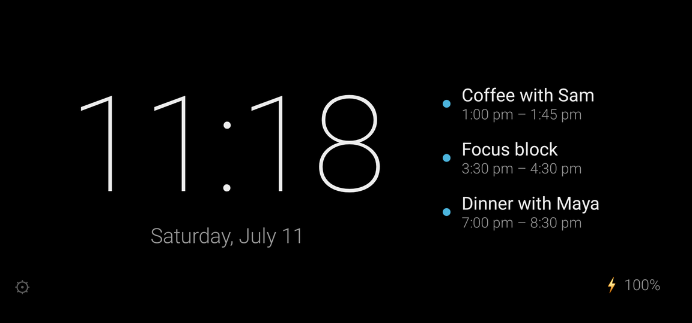
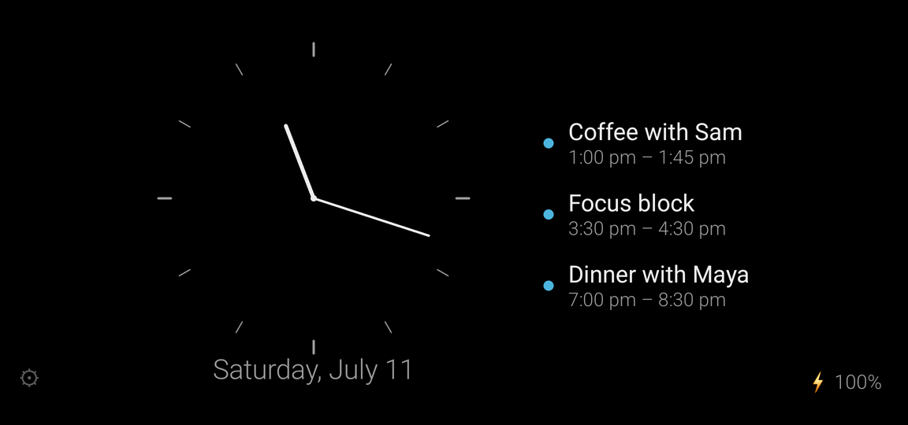
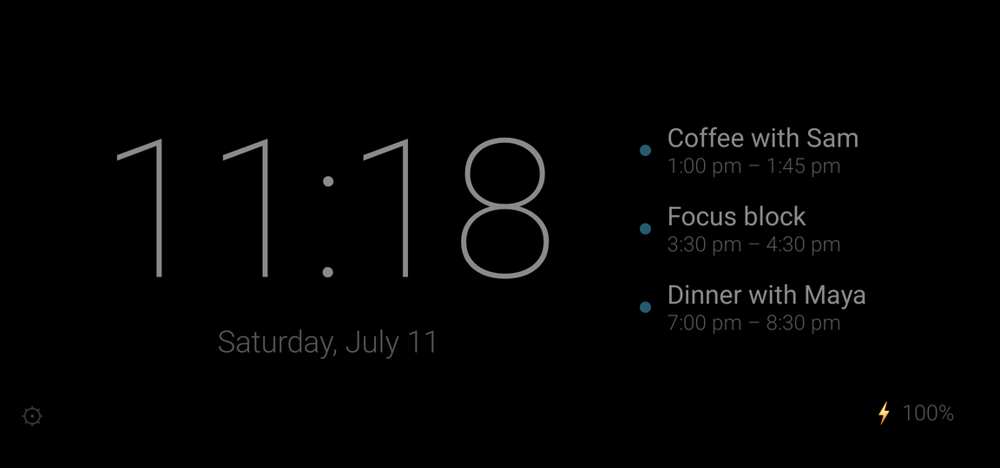
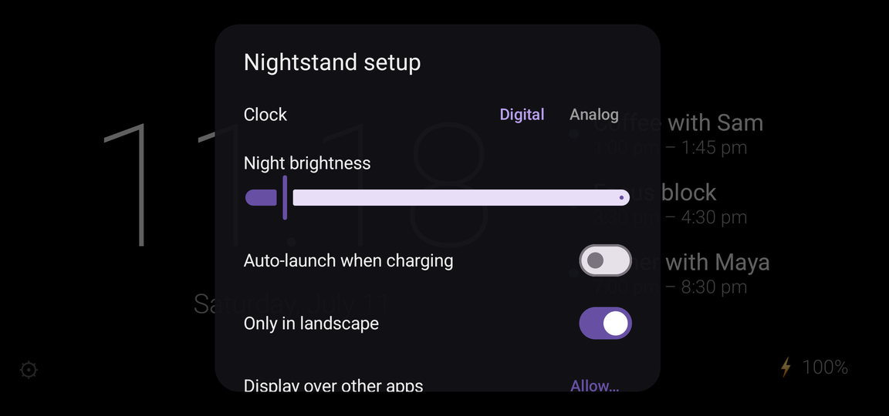

# Nightstand

An ad-free, tracker-free StandBy mode for Android. Charge your phone in
landscape and get a glanceable nightstand display — clock and today's
calendar — with **no ads, no in-app purchases, no analytics, and no
network permission at all**.



Inspired by iOS 17's StandBy. Built because the Play Store alternatives
show you an ad the moment your phone touches the charger.

| Analog face | Night mode |
|---|---|
|  |  |

## Features

- **Auto-launch on the charger** — plug in, turn the phone sideways, the
  clock appears; unplug and it goes away. Optional, works fully manually
  too.
- **Digital or analog clock**, date, and a subtle battery indicator.
- **Today's calendar events** beside the clock, with per-calendar
  filtering. Optional — the app is clock-only without calendar access.
- **Night mode**: tap anywhere to toggle between system brightness and a
  configurable night level (1–40%). OLED-friendly pure black, and the
  whole layout pixel-shifts every minute to prevent burn-in.
- **No network access.** The APK does not request the `INTERNET`
  permission, so it *cannot* phone home, fetch ads, or upload anything —
  the platform enforces it.



## Privacy

The full permission list, each optional and user-visible:

| Permission | Used for | Required? |
|---|---|---|
| Calendar | today's events next to the clock | no — clock works without |
| Display over other apps | auto-launch when charging | no — manual launch works without |
| Notifications | the persistent notification Android requires for the charger-trigger service | only with auto-launch |
| Run at startup | re-arm the charger trigger after a reboot | only with auto-launch |

No `INTERNET`, no location, no contacts, no storage — see the
[permissions budget](PLAN.md#permissions-budget-hard-cap) in PLAN.md.
Anything beyond that list needs a written justification first.

## Install

Nightstand is distributed as a signed APK on the
[releases page](https://github.com/ianpogi5/nightstand/releases) — it is
not on any app store.

1. On your phone, download `nightstand-x.y.z.apk` from the latest
   release.
2. Open the downloaded file. Android will ask you to allow installs from
   your browser (Settings → *Install unknown apps*) the first time —
   allow it, then confirm the install.
3. Or, with a computer and USB debugging: `adb install nightstand-x.y.z.apk`

Updates install over the top the same way; settings are kept. All
releases are signed with the same key — Android refuses mismatched
updates, so a tampered APK can't replace a genuine install. To check a
download yourself:

```sh
apksigner verify --print-certs nightstand-x.y.z.apk
# Signer #1 certificate SHA-256 digest:
# 1777f274935d861ce20048e62324c4b969338c38d20bd0621e37603ceaa7a981
```

### Setup

On first launch a setup sheet walks you through it:

- **Auto-launch when charging** needs *Display over other apps* — it is
  the one system permission Android requires for an app to appear on its
  own.
- **On Samsung (One UI)**: set App info → Battery → **Unrestricted**,
  or the system quietly kills the charger trigger after a few days.

## Building from source

```sh
./gradlew assembleDebug   # APK in app/build/outputs/apk/debug/
```

Requires a JDK on PATH and the Android SDK (point `local.properties` at
it with `sdk.dir=...`); Gradle provisions its own JDK 17 toolchain.

Release builds are signed if `local.properties` provides
`release.storeFile`, `release.storePassword`, `release.keyAlias`, and
`release.keyPassword`; otherwise `assembleRelease` produces an unsigned
APK.

## Principles

- No `INTERNET` permission, ever. Weather, sync, anything that needs the
  network is out of scope by design.
- Minimal permissions, each optional where the platform allows.
- Plain AOSP APIs, no vendor SDKs. Primary test device: Galaxy S23+
  (One UI 7 / Android 15). See [PLAN.md](PLAN.md) for the roadmap.

## License

[MIT](LICENSE)
